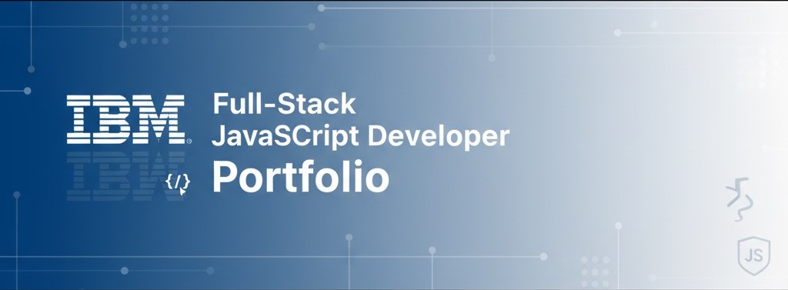

<!-- Header / Banner -->

  

<h1 align="center">IBM Full-Stack JavaScript Developer — Portfolio</h1>

  <!-- Shields / Badges -->
  
  
  
  

  This repository collects my learning progress and project documentation from the
  <b>IBM Full-Stack JavaScript Developer Professional Certificate</b>.
  It is organized for recruiters and engineers to verify both theory and hands-on skills quickly.

---

## 📂 Modules Overview

> Legend: ✅ Completed · ⏳ In progress · 🗓 Planned

| #  | Module | Folder | Status |
|----|--------|--------|:------:|
| 01 | Introduction to Software Engineering | [`01-Introduction to Software Engineering`](https://github.com/soonthorn707/ibm-fullstack-portfolio/tree/main/01-Introduction%20to%20Software%20Engineering) | ✅ |
| 02 | Introduction to HTML, CSS, & JavaScript | [`02-Introduction to HTML, CSS, & JavaScript`](https://github.com/soonthorn707/ibm-fullstack-portfolio/tree/main/02-Introduction%20to%20HTML%2C%20CSS%2C%20%26%20JavaScript) | ⏳ |
| 03 | Getting Started with Git and GitHub | [`03-Getting Started with Git and GitHub`](https://github.com/soonthorn707/ibm-fullstack-portfolio/tree/main/03-Getting%20Started%20with%20Git%20and%20GitHubd-git-github/README.md) | ⏳ |
| 04 | JavaScript Programming Essentials | [`04-JavaScript Programming Essentials`](https://github.com/soonthorn707/ibm-fullstack-portfolio/tree/main/04-JavaScript%20Programming%20Essentials) | ⏳ |
| 05 | Developing Front-End Apps with React | [`05-Developing Front-End Apps with React`](https://github.com/soonthorn707/ibm-fullstack-portfolio/tree/main/05-Developing%20Front-End%20Apps%20with%20React) | ⏳ |
| 06 | Developing Back-End Apps with Node.js & Express | [`06-Developing Back-End Apps with Node.js & Express`](https://github.com/soonthorn707/ibm-fullstack-portfolio/tree/main/06-Developing%20Back-End%20Apps%20with%20Node.js%20and%20Express) | ⏳ |
| 07 | Cloud Native, DevOps, Agile, and NoSQL | [`07-Cloud Native, DevOps, Agile, and NoSQL`](https://github.com/soonthorn707/ibm-fullstack-portfolio/tree/main/07-Get%20Started%20with%20Cloud%20Native%2C%20DevOps%2C%20Agile%2C%20and%20NoSQL) | ⏳ |
| 08 | Containers with Docker & Kubernetes | [`08-Containers with Docker & Kubernetes`](0https://github.com/soonthorn707/ibm-fullstack-portfolio/tree/main/08-Introduction%20to%20Containers%20w%20Docker%2C%20Kubernetes%20%26%20OpenShift) | ⏳ |
| 09 | Microservices & Serverless | [`09-Microservices & Serverless`](https://github.com/soonthorn707/ibm-fullstack-portfolio/tree/main/09-Application%20Development%20using%20Microservices%20and%20Serverless) | ⏳ |
| 10 | Node.js & MongoDB | [`10-Node.js & MongoDB`](https://github.com/soonthorn707/ibm-fullstack-portfolio/tree/main/10-Node.js%20%26%20MongoDB%20Developing%20Back-end%20Database%20Applications) | ⏳ |
| 11 | Full-Stack Capstone Project | [`1Full-Stack Capstone Project`](https://github.com/soonthorn707/ibm-fullstack-portfolio/tree/main/11-JavaScript%20Full%20Stack%20Capstone%20Project) | 🗓 |
| 12 | Career Guide & Interview Preparation | [`Career Guide & Interview Preparation`](https://github.com/soonthorn707/ibm-fullstack-portfolio/tree/main/12-Software%20Developer%20Career%20Guide%20and%20Interview%20Preparation) | 🗓 |

---

## 🧰 Tech Stack & Tools

  
  
  
  
  
  
  
  

---
## 👨‍💻 Author

**Name:** Sunthon Sutkhiao (Nickname: Aun)  
**Role:** Full-Stack Developer (Specialized in JavaScript Ecosystem)  
**Profile:** Documentation-driven development, scalable web applications, and cloud-native solutions.  
> TH: นักพัฒนา Full-Stack ที่มีทั้งทักษะด้าน **Frontend, Backend และ Cloud** พร้อม Portfolio จริง และพร้อมรับงานจริง

### 🛠 Core Skills
- **Frontend:** HTML5, CSS3, JavaScript (ES6+), React.js  
- **Backend:** Node.js, Express.js  
- **Database:** MongoDB Atlas, MySQL  
- **DevOps / Cloud:** Docker, GitHub Actions, CI/CD basics  
- **Software Engineering:** SDLC, Documentation, UML, Testing  

### 🎯 Career Focus
- Build modern, responsive, and scalable applications  
- Deliver production-ready solutions with clean architecture  
- Collaborate with cross-functional teams in Agile/DevOps environments  

### 📫 Contact
- GitHub: [soonthorn707](https://github.com/soonthorn707)  
- LinkedIn: [Sunthon Sutkhiao](https://www.linkedin.com/in/sunthon-sutkhiao-83192737b/)  
- Email: soonthorn707@gmail.com  

---

## 📜 License
Licensed under the [MIT License](LICENSE).
